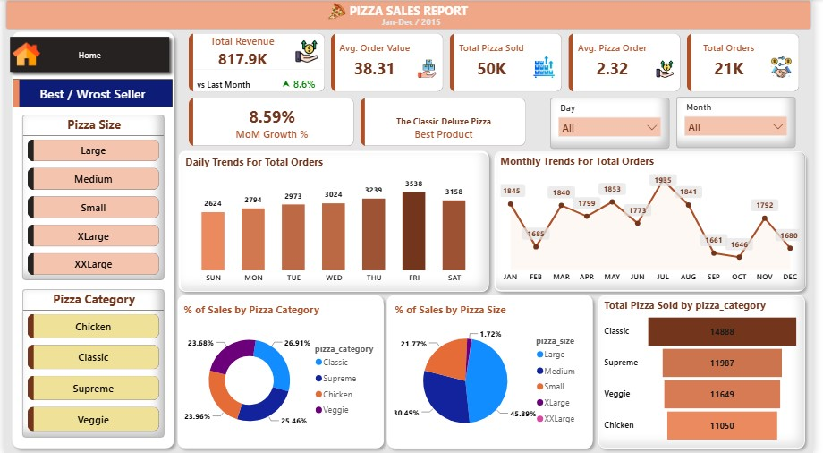
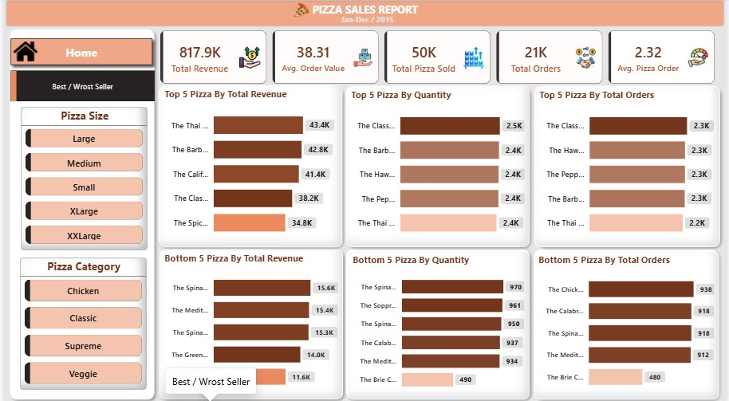

# 🍕 Pizza Sales Dashboard – Power BI

An interactive Power BI dashboard built to analyze pizza sales performance — covering revenue trends, order patterns, and best/worst selling products. The report is spread across **2 pages** with KPIs, trend charts, and slicers for deep-dive analysis.

---

## 📊 Dashboard Preview

### Home Page



### Best/Worst Seller Page


```

---

## 📁 Report Pages

### 1️⃣ Home
- KPI cards for high-level performance metrics
- Monthly sales trend (Clustered Column Chart)
- Revenue trend over time (Area Chart)
- Category-wise sales split (Donut Chart & Pie Chart)
- Order funnel analysis
- Slicers to filter by date, category, and size

### 2️⃣ Best / Worst Seller
- Top and bottom performing pizzas by revenue, quantity, and orders (Clustered Bar Charts)
- Side-by-side comparison to quickly spot best and worst sellers
- Slicers for interactive filtering

---

## 📈 Key Measures (DAX)

| Measure | Description |
|---|---|
| `Total Revenue` | Sum of total sales generated |
| `Total Orders` | Count of distinct orders placed |
| `Total Pizza Sold` | Total quantity of pizzas sold |
| `Avg. Order Value` | Average revenue per order |
| `Avg. Pizza Order` | Average pizzas per order |
| `Previous Month Revenue` | Revenue for the prior month (time intelligence) |
| `MoM Growth %` | Month-over-month revenue growth |
| `vs Last Month` / `vs Last Year` | Comparative performance indicators |
| `Best Product` | Top-selling pizza by chosen metric |

---

## 🗂️ Data Model

**Fact Table:** `pizza_sales`
- `pizza_id`, `order_id`, `pizza_name`, `pizza_category`, `pizza_size`
- `quantity`, `unit_price`, `total_price`
- `order_date`, `order_time`, `Month Name`, `Day Name`

**Dimension Table:** `Date` (Year, Month, Quarter, Day) — used for time intelligence and trend analysis.

---

## 🛠️ Tools & Skills Used

- **Power BI Desktop** – data modeling, DAX measures, report design
- **Power Query** – data cleaning and transformation
- **DAX** – KPIs and time-intelligence calculations
- **Data Visualization** – charts, slicers, and custom themes

---

## 🚀 How to Use

1. Clone or download this repository.
2. Open the `.pbit` file in **Power BI Desktop**.
3. When prompted, load/point it to the pizza sales dataset (or use the sample data provided).
4. Explore the report using the slicers and page navigation buttons.

---

## 📌 Note

This is a `.pbit` (Power BI Template) file, so it will ask for data on first open. Make sure the source dataset is available/connected before loading.

---

## 🙋‍♂️ Author

Built by **[Your Name]** as a data analytics/Power BI portfolio project.
Feel free to ⭐ this repo if you found it useful!
